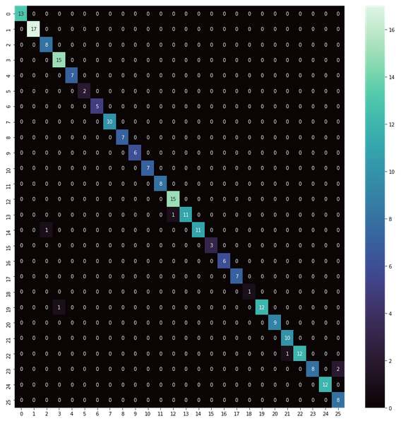

# Sign_Language_Recognition

## Objectif du projet

Beaucoup de progrès et de recherches en IA ont été faites pour aider les personnes sourdes et muettes. L'apprentissage profond et la vision par ordinateur peuvent également être utilisés pour avoir un impact sur cette cause.

Ce projet consiste à créer un modèle capable de classifier les lettres de l'alphabet de la langue des signes à partir d'une photo ou d'une vidéo. Afin d'entrainer notre modèle de classfication nous avons fabriqué un [dataset](dataset_final) de 800 images constitué de nos propres photos et d'images trouvé sur le net. 

## Traitement des données

Nous commençons par vouloir construire un [dataframe](data.csv) au format csv constitué de 3 colonnes : 
* Nom de l'image
* Path de l'image
* Son label

Le notebook est disponible [ici](generate_csv.ipynb)

## MediaPipe

Afin de classifier nos images par lettre de l'alphabet nous utiliserons les **coordonnées relatives** de la **main droite** (comprenant la position des doitgs). Pour ceci, nous utiliserons la librairie [MediaPipe](https://mediapipe.dev/) de **Google**. 

Pour chaque image, nous complètons le [dataframe](data_final.csv) précèdemment créé avec les coordonnées **x**, **y**, **z** des 21 points de la main. 

Le notebook est disponible [ici](csv_mediapipe.ipynb). 

## Le Modèle RandomForestClassifier

Afin de classifier nos images, nous utilisons un modèle **RandomForestClassifier** de la librairie **ScikitLearn**. Afin de contre-balancer le déséquilibre du nombre d'image pour chaque classe, nous utilisons la cross validation avec **StratifiedKFold** afin d'avoir une bonne repartition des nos classes pendant l'entrainemenet.

Nous obtenons un précision de **97%**, voici la matrice de confusion :

## Application

Pour tester le modèle : [app.py](app.py)
